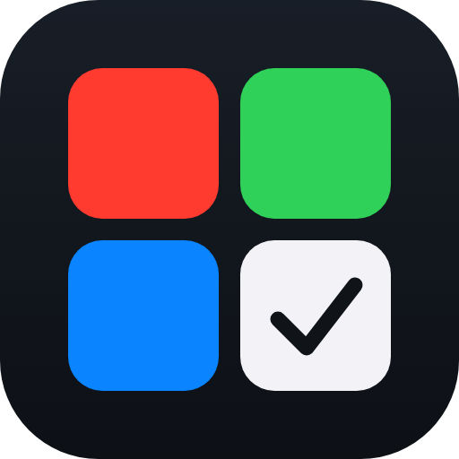
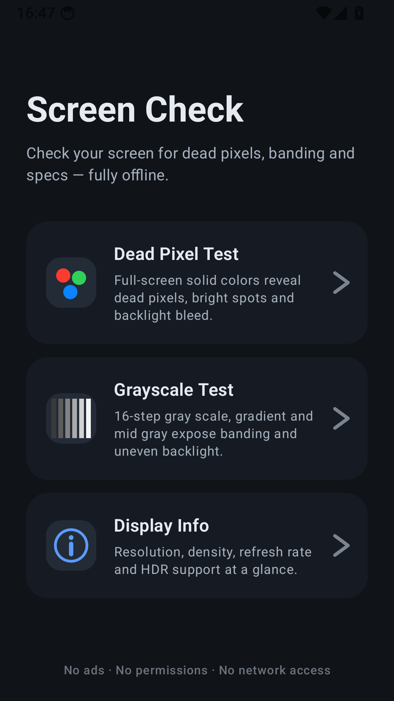
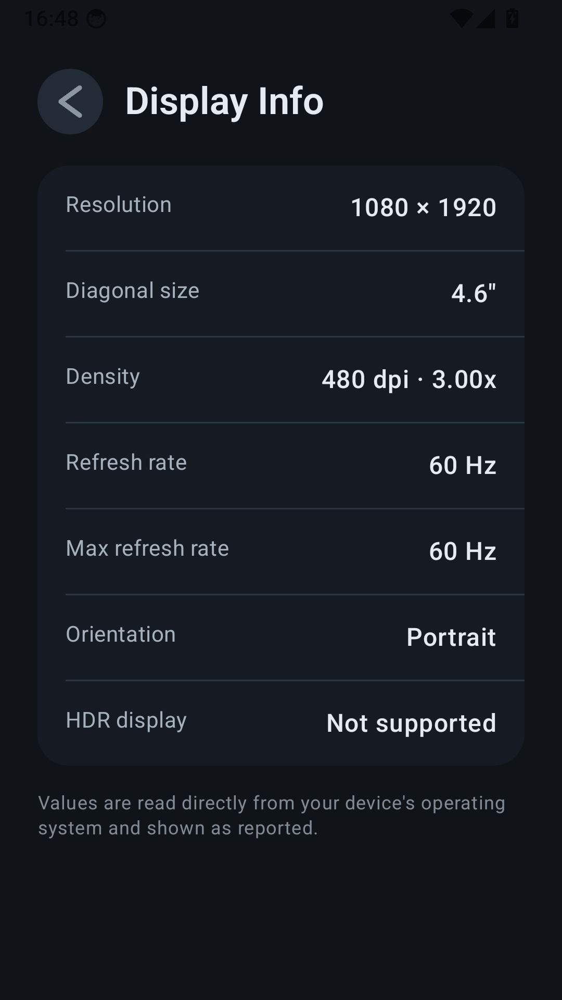

# Screen Check

<p align="center">
  
</p>

**Screen Check** is a simple, fully offline screen testing tool for Android.
Use it to check a brand-new phone, verify a second-hand display before a deal,
or inspect your own screen's condition and specs.

## Screenshots

<p align="center">
  
  
  
  
</p>

## Features

- **Dead Pixel Test** — full-screen solid colors (black → white → red → green → blue).
  Tap anywhere to switch colors, hold 1.5 s to exit. Immersive mode, keep-screen-on
  and maximum brightness are enabled automatically while testing and restored on exit.
- **Grayscale Test** — 16-step gray scale, horizontal black↔white gradient and mid
  gray to reveal color banding, crushed steps or uneven backlight.
- **Display Info** — resolution, diagonal size, pixel density, current and maximum
  refresh rate, orientation and HDR support, read directly from the operating system.
- **One-time hint** — the gesture hint appears only on first use; nothing is ever
  written to storage.

## Privacy

Screen Check is designed to be trustworthy by default:

- Requests **no permissions** — not even internet access. The app physically
  cannot send anything anywhere.
- **No ads, no analytics, no third-party SDKs** of any kind.
- Stores **nothing** on your device.

## Build

```bash
git clone https://github.com/apiaoa/ScreenCheck.git
cd ScreenCheck
./gradlew :app:assembleDebug   # APK at app/build/outputs/apk/debug/
```

Requirements: Android Studio (current stable) or JDK 17+ with the Android SDK
(compileSdk 36).

## Release build

Release signing is local-only and optional. Set up `keystore/screencheck-release.jks`
and `keystore.properties` (both are gitignored):

<details>
<summary>Signing setup</summary>

```bash
keytool -genkeypair -v -keystore keystore/screencheck-release.jks \
  -alias screencheck -keyalg RSA -keysize 2048 -validity 10950 \
  -dname "CN=Screen Check"

cat > keystore.properties <<EOF
storeFile=keystore/screencheck-release.jks
storePassword=<your-password>
keyAlias=screencheck
keyPassword=<your-password>
EOF
```

Then `./gradlew :app:assembleRelease` produces a signed APK and
`./gradlew :app:bundleRelease` a signed `.aab`.

</details>

## Tech

- Kotlin + Jetpack Compose, single-Activity, Material 3 dark theme
- No dependencies beyond AndroidX Compose — zero third-party libraries
- All graphics are drawn in code (Compose Canvas and vector drawables); the
  release APK is under 1 MB
- minSdk 26 · targetSdk 36

## License

Licensed under the [Apache License 2.0](LICENSE).
